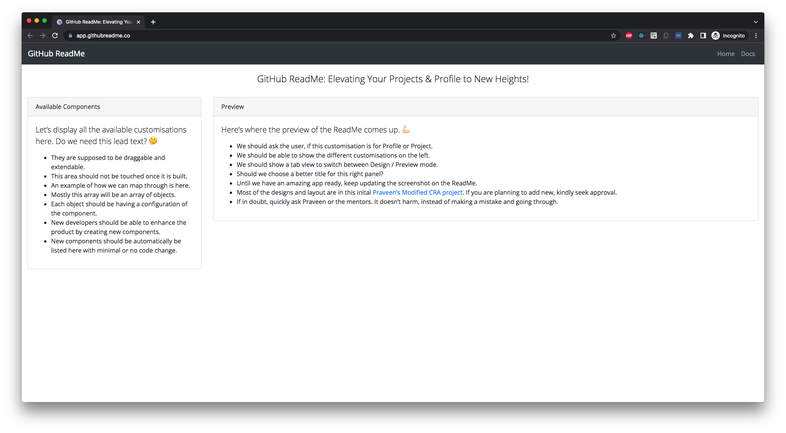
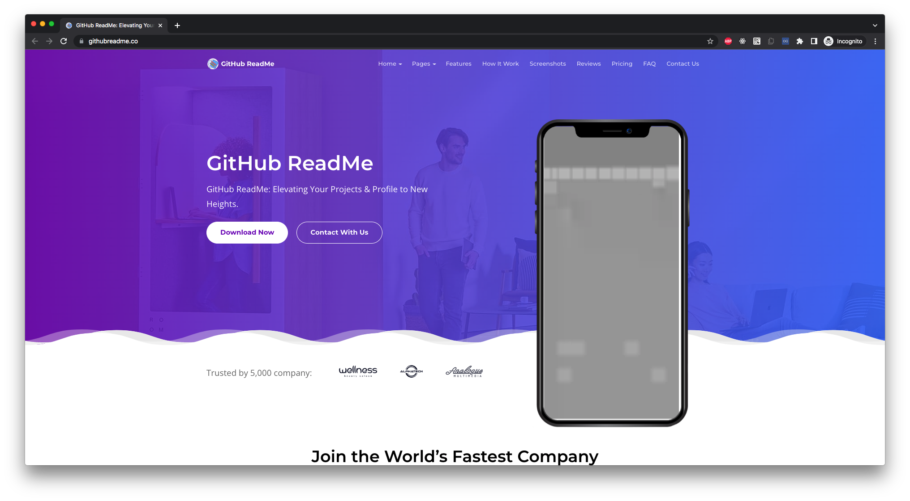

# GitHub ReadMe Generator


## Table of Contents

- [Introduction](#introduction)
  - [Motivation](#motivation)
  - [Product Features](#product-features)
- [Development](#development)
  - [System Requirements](#system-requirements)
  - [Installation & Running Instructions](#installation--running-instructions)
  - [ScreenCast](#screencast)
- [Contribution Guidelines](#contribution-guidelines)
  - [Quick Steps to Contribute](#quick-steps-to-contribute)
  - [Multiple Branches](#multiple-branches)
  - [GirlScript Summer of Code](#girlscript-summer-of-code)
    - [Labels & Points Guidance](#labels--points-guidance)
    - [Mentors](#mentors)
    - [Project Admin](#project-admin)
- [Demos](#demos)
  - [Live Demo](#live-demo)
  - [Video Demo](#video-demo)
    - [Landing Page](#landing-page)
    - [Hosted App](#hosted-app)
- [Contributors](#contributors)
- [Resources](#resources)
  - [YouTube Videos](#youtube-videos)

<br />
<div style="text-align: center;">
  
  
  
  <br />
  
  <a href="LICENSE"></a>
  
  
  
  
  
  
  
  
  
</div>
<br />
  

## Introduction

Introducing our latest product, the hassle-free and open-source GitHub Profile ReadMe customisation tool! With no login or registration required, you can quickly mix and match different components to create an impressive and informative GitHub Profile ReadMe page. Our drag and drop functionality makes the customisation a breeze, and with the tool being Open Source, you can expect new ideas and features to be added regularly. Try it out today and take your GitHub profile to the next level! 💪🏻

This project is exclusive to GirlScript Summer of Code and it’s assumed that you’re participating in it, so kindly don’t specify this if you’re raising an issue or a pull request. I’ll be definitely giving sarcastic responses, if you fail to follow this and don’t blame me! 😅

### Motivation

As a software engineer, I understand the importance of having a well-organised and informative GitHub profile ReadMe page. It not only helps users understand the developer’s skills and experience but also showcases their creativity and attention to detail. However, with so many people creating different styles of ReadMe pages, it can be challenging to keep track of all the available components and customisation options. 🤯

That’s why I believe that creating a comprehensive guide to GitHub profile ReadMe customisation is a valuable project. By compiling all the available components and customisation options in one place, we can provide developers with a go-to resource for creating impressive and informative profile ReadMe pages. This project will not only help developers save time by not having to search for different options but also ensure that they don’t miss out on any essential components. 🥹

As a software engineer, I am committed to creating user-focused software that meets the needs of the end-user. By providing a comprehensive guide to GitHub profile ReadMe customisation, we can help developers create intuitive and user-friendly interfaces that enhance the user experience. Additionally, I understand the importance of time management and quality assurance in software development. By thoroughly testing and ensuring that the guide is free of bugs and errors, we can deliver a high-quality resource that developers can rely on. 👌🏻

In summary, this project is motivated by the need to provide developers with a comprehensive guide to GitHub profile ReadMe customisation. By doing so, we can help developers save time, not miss out on any essential components, and create user-focused and high-quality profile ReadMe pages that showcase their skills and experience. 💪🏻

### Product Features

Here's a list of all the features of our GitHub Profile ReadMe customisation tool:

* 🔓 No login or registration required.
* 🚀 Hassle-free and easy to use.
* 🎨 Mix and match different components to create a customised profile ReadMe page.
* 🖱️ Drag and drop functionality for easy customisation.
* 🌐 Open source, allowing for new ideas and features to be added regularly.
* 📚 Comprehensive guide to GitHub profile ReadMe customisation.
* 👥 User-focused software that enhances the user experience.
* 🐛 Thoroughly tested and free of bugs and errors, I hope! 😅
* ⏰ Saves time by providing all available components and customisation options in one place.
* 💪🏻 Helps developers create high-quality and informative GitHub Profile ReadMe pages that showcase their skills and experience.

With our GitHub profile ReadMe customisation tool, you can take your GitHub profile to the next level and impress potential employers and collaborators. Try it out today and see the difference it can make! 🤗

[⬆️ Back to Top](#table-of-contents)

## Development

### System Requirements

Here’s a recommended guide, but if you want to know what exactly I use, feel free to check out [My Personal Development Environment](https://blog.praveen.science/my-personal-development-environment/) and clone it for yourself. 💻

* **Operating System:** Windows / Mac / Linux
* **Version Control:** Git
* **Browser:** Google Chrome + React Developer Tools
* **Run Time:** Node JS 18.16.0 LTS
* **IDE:** Microsoft Visual Studio Code

### Installation & Running Instructions

First step is to “Fork” the project under your name and keep the `main` branch always sync’d with this repository to ensure there are no issues with your Pull Request like those dreaded Merge Conflicts! 😈

1. Clone the Repository (your fork) and make sure it’s in the latest `main` branch.
2. If you think it might be stale, issue a `git pull` so that it’s up to date.
3. If you’re running for the first time, install the dependencies by running `npm ci` (or if you’re not lazy, run `npm clean-install`).
4. Once the installation is over, start the app locally by running `npm start`.
5. Hope everything works, check by opening http://localhost:3000/ on your browser (it might have already started your browser, kindly check).

Here are all the commands...

```bash
$ git clone https://github.com/<Your-GitHub-Username>/GitHub-ReadMe.git
$ npm ci
$ npm start
```

If `npm ci` gives issues on Windows or Linux machines, please use `npm i` (or if you’re not lazy, run `npm install`).

If you’re facing any issues, feel free to message me on WhatsApp / LinkedIn / Twitter / Discord / Email (on the order of responsivenes, email being the slowest)! 😅

### ScreenCast

(TODO: Video of a user doing the installation!)

[⬆️ Back to Top](#table-of-contents)

## Contribution Guidelines

### Quick Steps to Contribute

There are two ways to contribute to this project.

1. **Landing Page:** Very basic HTML, CSS and JavaScript Static Website.
2. **Web App:** Again another beginner friendly React JS App that uses Node SASS for SCSS and React Router v6.

Here are some quick and simple instructions, which no one can mess up! 💪🏻

1. Fork & Star the Repo and don’t forget to [Subscribe to my YouTube Channel](https://www.youtube.com/praveenscience?sub_confirmation=1) for Updates on this! 💪🏻
2. Get connected with [Praveen Kumar](https://praveen.science/) so that you can have a quick discussion regarding new features or issues! 🐛
3. Read through the instructions to set it up locally. 💻
   1. Make sure you have configured your environment properly before installation.
   2. Install all the dependencies and issue the start command.
4. Run the project and explore every bit of the project. Here’s a [walkthrough](https://www.youtube.com/praveenscience?sub_confirmation=1) video! 📺
5. Understand the already raised - accepted issues to start work with. 🤔
   1. If the issue is already assigned to someone else, please enter your comment but look through and try to see how you can fit.
   2. If it’s not already assigned, tell how you can solve this issue, explain your procedure in your mind and ask to assign.
6. If you can’t find any issues, identify potential bugs or improvements for the project! 🔎
7. Once you’ve been assigned the issue, kindly follow the [Contributing Guidelines](./CONTRIBUTING.md) and make a Pull Request! 🤝🏻
8. I’ll go through your PR and if it’s of good quality, congrats, thanks for your contribution. 😁
9. Occasionally, if there are some issues, I’ll definitely point them out and I won’t close the PRs without a valid info! 🥹

### Multiple Branches

Note that there are totally three branches initially. 🍃

* `main` - Has the Source Code of the React App.
* `gh-pages` - The React App is deployed in this branch.
* `website` - The Landing Page source code is in this branch, will be using an alternate deployment method using Cloudflare Pages.

In doubt, please ask a question! 💪🏻

### GirlScript Summer of Code

This repository is dedicated to GSSoC ’23, so kindly don’t add anything like “as a part of GSSoC” on the issues.

#### Labels & Points Guidance

The whole pointing system in GSSoC ’23 is automated, so there’s no manual entry of creating any sheets or anything! 💪🏻

> **Note:** The below has not been verified yet. Please wait till the official points are out.

| Label Name | Difficulty | Points |
| ---------- | ---------- | ------ |
| `easy`     | Easy       | 10      |
| `medium`   | Medium     | 25     |
| `hard`     | Hard       | 45     |

#### Mentors

> **Note:** The below list is subject to change due to an ongoing confusion. Please wait till this message is removed.

| Name              | GitHub                                                      | Twitter | LinkedIn                                                     | Email                                   |
| ----------------- | ----------------------------------------------------------- | ------- | ------------------------------------------------------------ | --------------------------------------- |
| Ashwin Kumar R    | [GitHub: @Ash515](https://github.com/Ash515)                |         | [Ashwin Kumar Ramaswamy](https://linkedin.com/in/ashwinkumarramasamy/) | [:envelope:](theyoungtech515@gmail.com) |
| Rose Kamal Love   | [GitHub: @rosekamallove](https://github.com/rosekamallove)  |         | [Rose Kamal Love](https://www.linkedin.com/in/rose-kamal-love-1146141b0/) | [✉️](rosekamallove@gmail.com)            |
| Anoop Kumar Singh | [GitHub: @anoopsingh1996](http://github.com/anoopsingh1996) |         | [Anoop Singh](http://linkedin.com/in/anoopsingh1996/)        | [✉️](anoopraghuvansi@gmail.com)          |
| Rachit Agarwal    | [GitHub: @rachitag112](https://github.com/rachitag112)      |         | [Rachit Agarwal](https://www.linkedin.com/in/rachitag112/)                   | [✉️](rachitag112@gmail.com)              |

#### Project Admin

| Praveen Kumar Purushothaman                                  |
| ------------------------------------------------------------ |
|  |
| <table><tbody><tr><th>Position</th><td>Full Stack JavaScript Specialist</td></tr><tr><th>LinkedIn</th><td>[Praveen Kumar Purushothaman](https://www.linkedin.com/in/praveentech/)</td></tr><tr><th>Twitter</th><td>[Praveen Kumar Purushothaman](https://twitter.com/praveenscience)</td></tr><tr><th>GitHub</th><td>[Praveen Kumar Purushothaman](https://github.com/praveenscience)</td></tr><tr><th>YouTube</th><td>[Praveen Kumar Purushothaman](https://www.youtube.com/@praveenscience?sub_confirmation=1)</td></tr></tbody></table> |

[⬆️ Back to Top](#table-of-contents)

## Demos

(TODO: Image of the GitHub ReadMe Generator, keep this dynamically updated every time the app is updated)

### Live Demo

If you want to try out the application, check out the [Production App](https://app.GitHubReadMe.co) here. 😁



Also we have a marketing page, check out the [Landing Page](https://GitHubReadMe.co) as well! 🤗



### Video Demo

For the chilled out folks, I have created a couple of videos here for both the landing page for marketing this app and the hosted app itself! 😁

#### Landing Page

(TODO: Add the video...)

#### Hosted App

(TODO: Add the video...)

[⬆️ Back to Top](#table-of-contents)

## Contributors

<a href="https://github.com/CatsInTech/GitHub-ReadMe/graphs/contributors">
  
</a>
<br />
<br />

Thank you to all the amazing contributors who have made this project possible! 💪🏻

Show some ❤️ by starring this awesome repository! 🌟

[⬆️ Back to Top](#table-of-contents)

## Resources

### YouTube Videos

All the YouTube Videos that are related to this project are listed in chronological order.

#### [Official Playlist](https://www.youtube.com/playlist?list=PLO_Y0rsm7b3bengFlB69pxuQcl9vmGmhk)

1. [Intro to Cats in Tech GitHub ReadMe](https://youtu.be/NbUJN5sSRg4?list=PLO_Y0rsm7b3bengFlB69pxuQcl9vmGmhk)
2. [Cats in Tech GitHub ReadMe Project Information (Trailer)](https://youtu.be/qmPRg5qIXYw?list=PLO_Y0rsm7b3bengFlB69pxuQcl9vmGmhk)
3. [Cats in Tech GitHub ReadMe Project Information](https://youtu.be/JfUWUF-mq6k?list=PLO_Y0rsm7b3bengFlB69pxuQcl9vmGmhk)
4. Steps to Start with Open Source through GSSoC ’23 (WIP)
5. How to get the best out of GSSoC ’23 (WIP)
6. Contribution Instructions for First Timers (WIP)

[⬆️ Back to Top](#table-of-contents)
